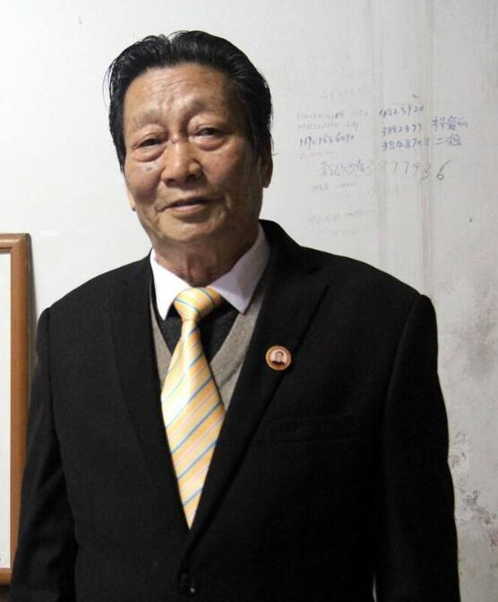

# 年广久

- 姓名：年广久
- 性别：男
- 国籍：中国
- 出生日期：1940年1月17日
- 去世日期：2023年1月11日
- 去世原因：待补充

# 生平简介

安徽怀远人，"傻子瓜子"创始人，被誉为"中国第一商贩"。出身贫苦，一生从事瓜子生意，经历多次沉浮。其事迹曾引起邓小平关注，成为中国经济体制改革的标志性人物。

# 主要贡献

创立"傻子瓜子"品牌，推动中国民营经济发展，是改革开放的先行者和见证者，2018年入选"改革开放40年百名杰出民营企业家"名单。

# 参考资料

- 百度百科链接：
