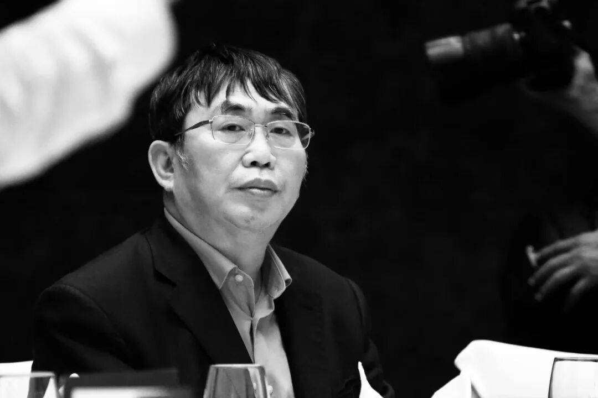

# 聂卫平

- 姓名：聂卫平
- 性别：男
- 国籍：中国
- 出生日期：1952年8月17日
- 去世日期：2026年1月14日
- 去世原因：病逝（直肠癌）

# 生平简介

聂卫平，1952年8月17日生于辽宁沈阳，籍贯河北深州，中国围棋职业九段棋手，中国围棋协会名誉主席，被国家体委授予"棋圣"称号。九岁开始学棋，师从张福田、过惕生、陈祖德等名手。1973年入选中国围棋集训队，开启围棋生涯。1984年4月加入中国民主同盟，1986年2月加入中国共产党。1988年3月，被国家体委正式授予"棋圣"称号。历任中国围棋协会副主席、名誉主席，并出任围棋国家队总教练，带教出常昊等世界冠军。1999年获评"新中国棋坛十大杰出人物"。2026年1月14日晚22时55分因病医治无效在北京逝世，享年73岁。

# 主要贡献

聂卫平是上世纪中国围棋振兴的关键人物。上世纪八十年代的中日围棋擂台赛中，他作为中国队主将力挽狂澜，创下11连胜的"擂台神话"，连克小林光一、加藤正夫、藤泽秀行等日本超一流棋手，三度率中国队夺得前三届擂台赛冠军，终结了日本围棋长期垄断的格局，极大振奋了民族精神，掀起了全国围棋热潮。作为围棋国家队总教练，他培养出常昊等世界冠军，对中国围棋的普及、发展和走向世界作出了奠基性贡献。

# 参考资料

- 百度百科链接：https://baike.baidu.com/item/%E8%81%82%E5%8D%AB%E5%B9%B3
