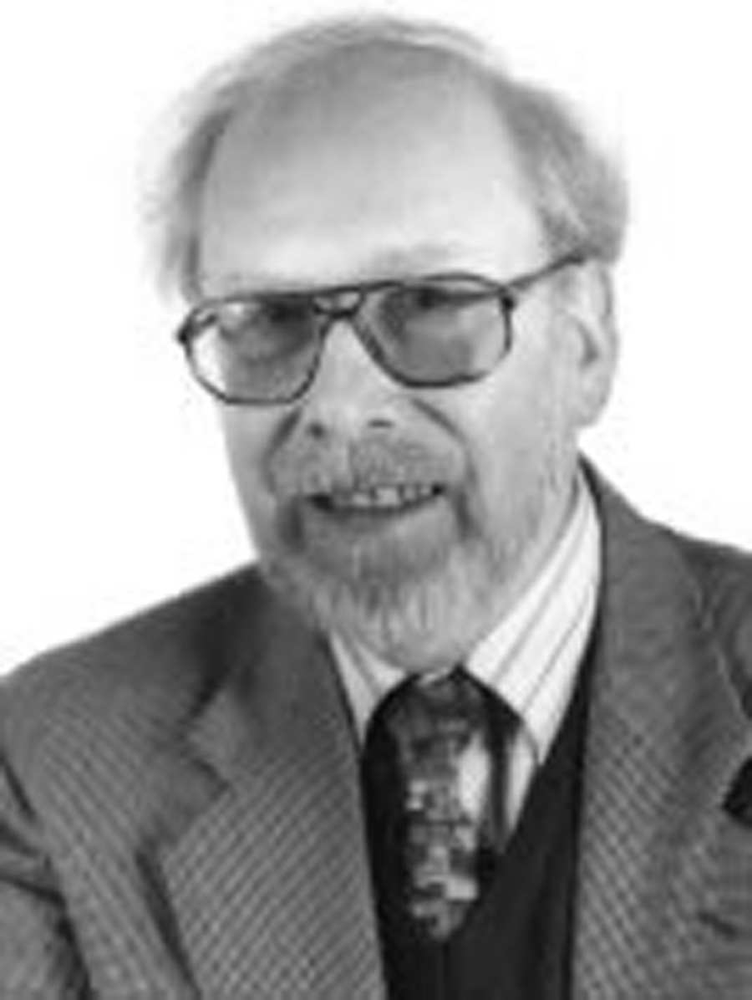

# Niklaus Wirth

- 姓名：Niklaus Wirth（尼古拉斯·沃斯）
- 性别：男
- 国籍：瑞士
- 出生日期：1934年2月15日
- 去世日期：2024年1月1日
- 去世原因：自然逝世

# 生平简介

出生于瑞士温特图尔，1958年从苏黎世工学院取得学士学位，后赴加拿大莱维大学深造，随后在美国加州大学伯克利分校攻读博士。1963年取得博士学位后被斯坦福大学聘为计算机科学部助理教授。在斯坦福大学成功开发Algol W以及PL360后，于1967年回到瑞士。1968年在苏黎世工学院创建了Pascal语言。1999年退休。

# 主要贡献

设计了Algol W、Pascal、Modula、Modula-2、Oberon等编程语言，对计算机科学教育产生深远影响。1984年获得图灵奖。其著作《算法+数据结构=程序》成为计算机科学经典。1988年获IEEE计算机先锋奖。1994年当选美国国家工程院院士。

# 参考资料

- 百度百科链接：https://www.baike.com/wiki/Niklaus+Wirth
