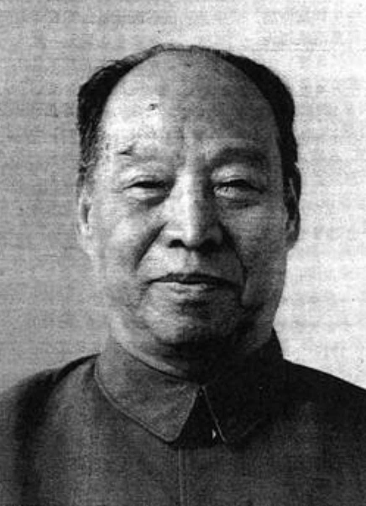

# 彭真

- 姓名：彭真
- 性别：男
- 国籍：中国
- 出生日期：1902年10月12日
- 去世日期：1997年4月26日
- 去世原因：因病医治无效

# 生平简介

彭真，山西曲沃人，中国共产党的优秀党员，久经考验的忠诚的共产主义战士。1923年加入中国共产党。长期担任党和国家领导职务，曾任北京市市长、中央书记处书记、全国人大常委会委员长。1997年4月26日在北京逝世，享年95岁。

# 主要贡献

新中国成立初期主持北京工作；改革开放后主持宪法修改和立法工作，为社会主义民主法制建设作出奠基性贡献。

# 参考资料

- 百度百科链接：https://baike.baidu.com/item/%E5%BD%AD%E7%9C%9F
