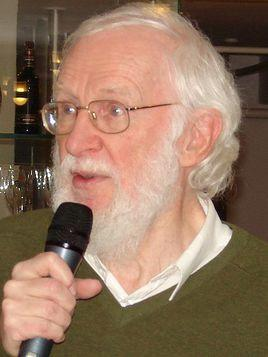

# 彼得·诺尔

- 姓名：Peter Naur（彼得·诺尔）
- 性别：男
- 国籍：丹麦
- 出生日期：1928年10月25日
- 去世日期：2016年1月3日
- 去世原因：自然逝世

# 生平简介

出生于丹麦腓特烈斯堡，先后在哥本哈根大学学习天文学并取得学位。在编程语言设计、编译器设计以及计算机编程的理论与实践方面做出了根本性的贡献。曾任哥本哈根大学教授。他是2005年图灵奖得主，也是迄今为止唯一一位获此殊荣的丹麦籍科学家。

# 主要贡献

改进了巴科斯-诺尔范式（BNF），对ALGOL 60编程语言的开发做出了重要贡献。BNF成为描述编程语言语法的标准方法，影响了后续所有编程语言的设计。在软件工程方法论方面也有深远影响。

# 参考资料

- 百度百科链接：https://www.baike.com/wiki/%E5%BD%BC%E5%BE%97%C2%B7%E8%AF%BA%E5%B0%94
