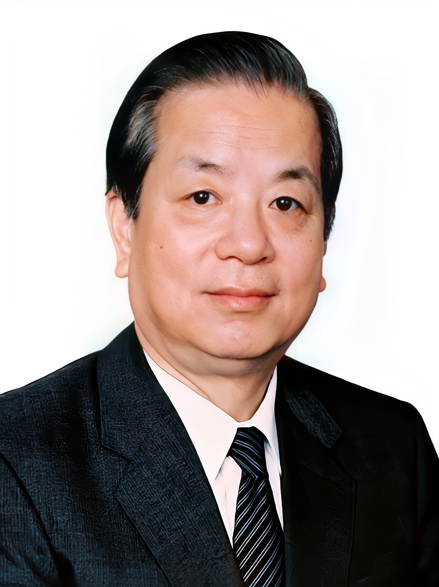

# 钱其琛

- 姓名：钱其琛
- 性别：男
- 国籍：中国
- 出生日期：1928年1月5日
- 去世日期：2017年5月9日
- 去世原因：自然死亡

# 生平简介

钱其琛，出生于上海，中国著名外交家。1942年加入中国共产党，1945年开始从事外交工作。曾任外交部副部长、部长，国务院副总理等职。他参与了许多重要外交事件的处理，为中国的外交事业做出了重要贡献。2017年5月9日在北京逝世，享年89岁。

# 主要贡献

钱其琛是中国外交界的重要领导人，他在任期间推动了中国与世界各国的友好关系。他参与了香港回归谈判等重要外交事务，为维护国家主权和利益做出了贡献。他获得过联合国特别奖等荣誉。

# 参考资料

- 百度百科链接：https://m.baike.com/wiki/%E9%92%B1%E5%85%B6%E5%A8%9A/652893