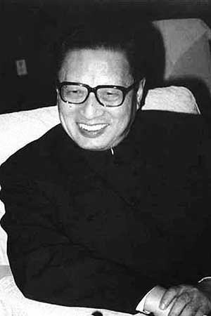

# 乔石

- 姓名：乔石
- 性别：男
- 国籍：中国
- 出生日期：1924年12月
- 去世日期：2015年6月14日
- 去世原因：因病医治无效

# 生平简介

乔石，浙江定海人，中国共产党的优秀党员，党和国家的卓越领导人。1940年加入中国共产党。曾任中共中央办公厅主任、中央政法委员会书记、国务院副总理。1987年当选中央政治局常委，1993年至1998年任全国人大常委会委员长。2015年6月14日在北京逝世，享年91岁。

# 主要贡献

长期主持政法和立法工作，推动社会主义民主法制建设，为依法治国基本方略的确立作出重要贡献。

# 参考资料

- 百度百科链接：https://baike.baidu.com/item/%E4%B9%94%E7%9F%B3
