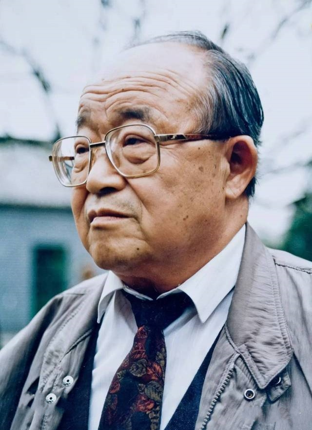

# 乔羽

- 姓名：乔羽
- 性别：男
- 国籍：中国
- 出生日期：1927年11月16日
- 去世日期：2022年6月20日
- 去世原因：自然衰老

# 生平简介

原名乔庆宝，中国著名词作家、剧作家，被誉为"词坛泰斗"。曾任中国歌剧舞剧院院长。

# 主要贡献

创作1000多首脍炙人口的歌词，代表作包括《我的祖国》《让我们荡起双桨》《难忘今宵》《爱我中华》等，影响了几代中国人的成长。

# 参考资料

- 百度百科链接：
