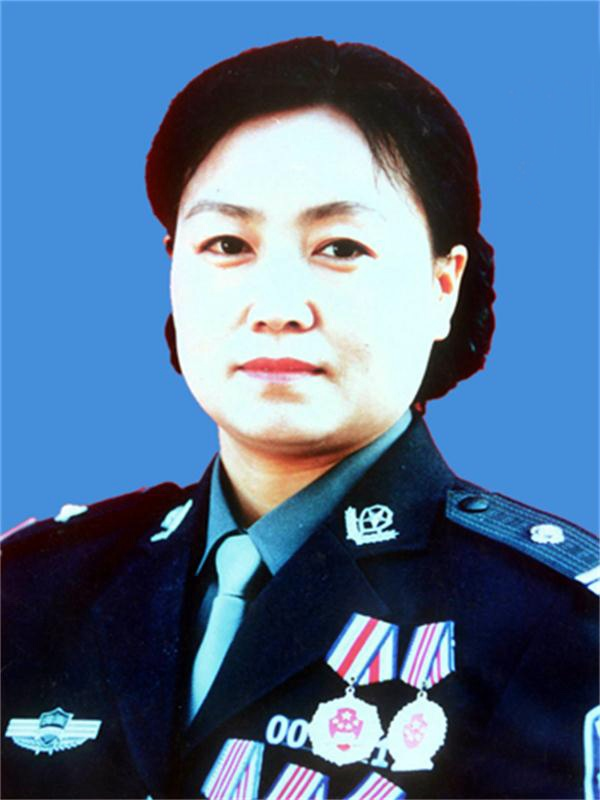

# 任长霞

- 姓名：任长霞
- 性别：女
- 国籍：中国
- 出生日期：1964年2月8日
- 去世日期：2004年4月14日
- 去世原因：车祸因公殉职

# 生平简介

任长霞，1964年2月8日出生于河南省商丘市睢县，中国共产党党员，生前系河南省登封市公安局党委书记、局长。她毕业于河南省人民警察学校，1983年参加公安工作，先后在郑州市公安局中原分局、郑州市公安局法制室、郑州市公安局技侦支队任职。2001年4月，任长霞调任登封市公安局局长，成为河南省公安系统有史以来第一位女公安局长。

在任期间，任长霞始终把人民群众的安危冷暖放在心头，深入基层调查研究，走访群众了解社情民意。她带领全局民警破获了一大批刑事案件，打掉多个黑恶势力团伙，有效维护了当地社会治安。她设立局长接待日，认真倾听群众诉求，被百姓亲切地称为"任青天"、"女神警"。2004年4月14日晚，任长霞在侦破一起案件从郑州返回登封途中遭遇车祸，不幸因公殉职，年仅40岁。

# 主要贡献

任长霞在担任登封市公安局局长期间，以打击犯罪、保护人民为己任，先后组织破获各类刑事案件3420起，打掉黑恶势力团伙20余个，抓获犯罪嫌疑人4362人。她大力推行政务公开，建立局长接待日制度，接待来访群众3400余人次，解决了一大批群众反映强烈的治安问题。她亲自组织侦破了"1·6"系列杀人案、"3·15"特大系列抢劫案等多起重大恶性案件。

任长霞是新时代中国公安民警的杰出代表，她的感人事迹在全国引起强烈反响。2004年6月，她被公安部追授为"全国公安系统一级英雄模范"称号，被全国妇联追授为"全国三八红旗手"。她的精神激励了一代又一代公安民警，成为永恒的时代丰碑。

# 参考资料

- 百度百科链接：https://m.baike.com/wiki/任长霞
