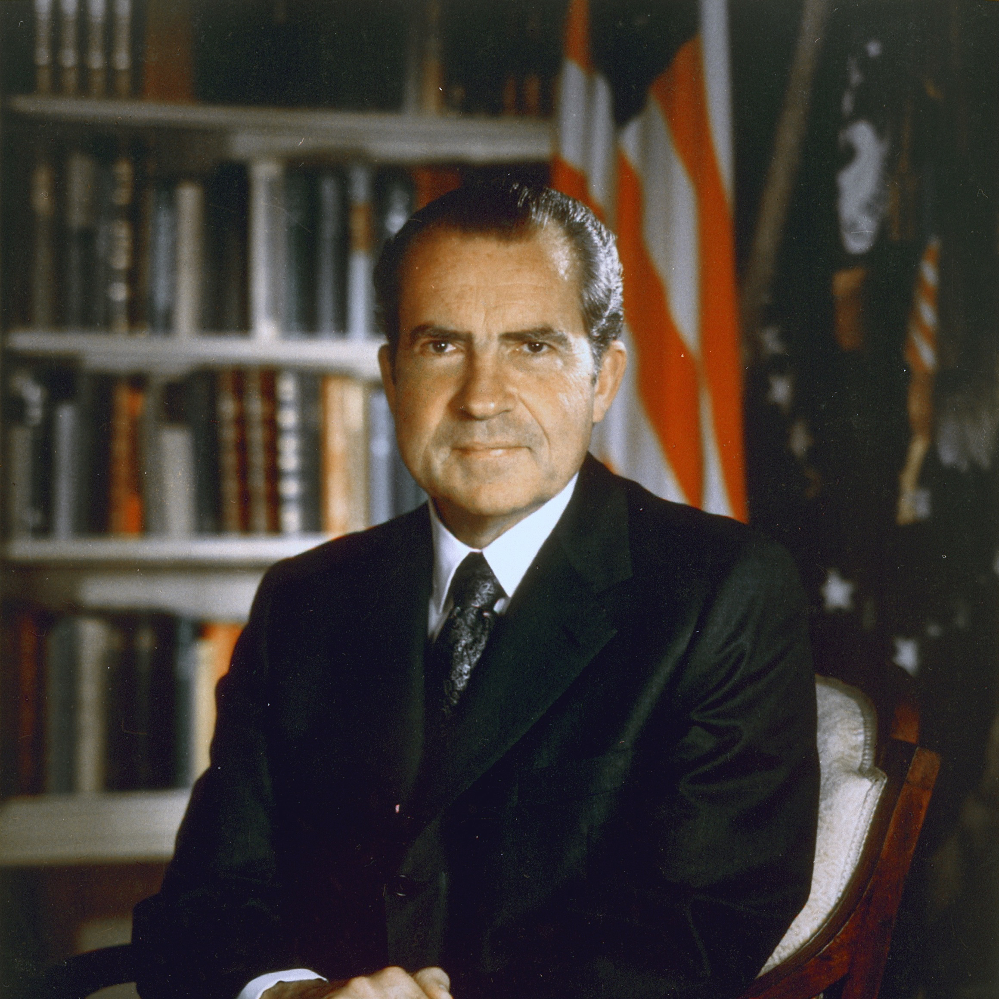

# 理查德·尼克松

- 姓名：理查德·尼克松
- 性别：男
- 国籍：美国
- 出生日期：1913年1月9日
- 去世日期：1994年4月22日
- 去世原因：中风

# 生平简介

理查德·尼克松（Richard Nixon），出生于美国加利福尼亚州，美国第37任总统。1946年当选美国众议院议员，1952年当选副总统。1968年当选总统，1972年连任。任内推行"尼克松主义"，改善中美关系，1972年访华，开启中美关系正常化进程。1974年因水门事件辞职，成为美国历史上第一位辞职的总统。1994年4月22日因中风逝世，享年81岁。

# 主要贡献

尼克松是中美关系正常化的开拓者，1972年访华实现了中美两国领导人的历史性会晤，签署了《上海公报》，为中美建交奠定了基础。他推行的外交政策对冷战格局产生了重要影响。

# 参考资料

- 百度百科链接：https://m.baike.com/wiki/%E7%90%86%E6%9F%A5%E5%BE%B7%C2%B7%E5%B0%BC%E5%85%8B%E9%80%8A/355619