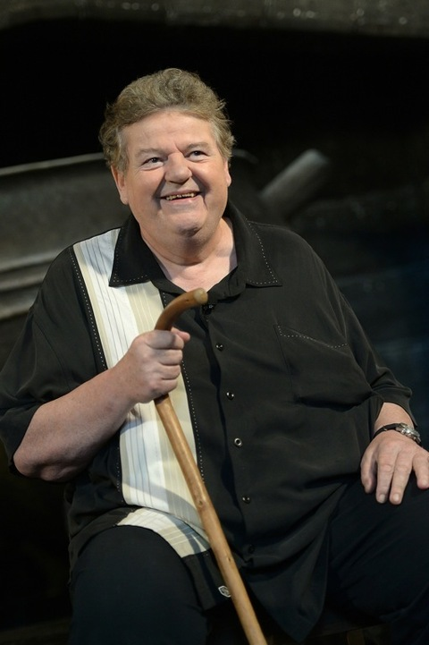

# Robbie Coltrane

- 姓名：Robbie Coltrane
- 性别：男
- 国籍：英国
- 出生日期：1950年3月30日
- 去世日期：2022年10月14日
- 去世原因：多器官功能衰竭

# 生平简介

原名Anthony Robert McMillan，苏格兰演员，以在《哈利·波特》系列电影中饰演鲁格斯·海格而被全球观众熟知。

# 主要贡献

在《哈利·波特》系列中塑造的霍格沃茨猎场看守人海格形象深入人心。演艺生涯涵盖电影、电视和戏剧，获得众多奖项认可。

# 参考资料

- 百度百科链接：https://m.baike.com/wiki/%E7%BD%97%E5%BD%BC%C2%B7%E8%80%83%E7%89%B9%E6%8B%89%E5%B0%BC/2286417
