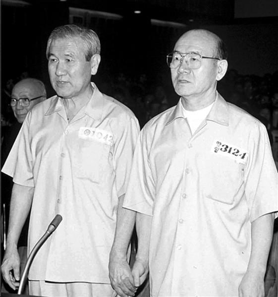

# 卢泰愚（Roh Tae-woo）

- 姓名：卢泰愚（Roh Tae-woo）
- 性别：男
- 国籍：韩国
- 出生日期：1932年12月4日
- 去世日期：2021年10月26日
- 去世原因：因病医治无效

# 生平简介

卢泰愚，韩国政治家、军人，生于大邱。1988年至1993年任韩国总统。2021年10月26日在首尔逝世，享年88岁。

# 主要贡献

任内推行"北方外交"，与苏联、中国建交，推动朝鲜半岛南北关系缓和。

# 参考资料

- 百度百科链接：https://baike.baidu.com/item/%E5%8D%A2%E6%B3%B0%E6%84%9A
