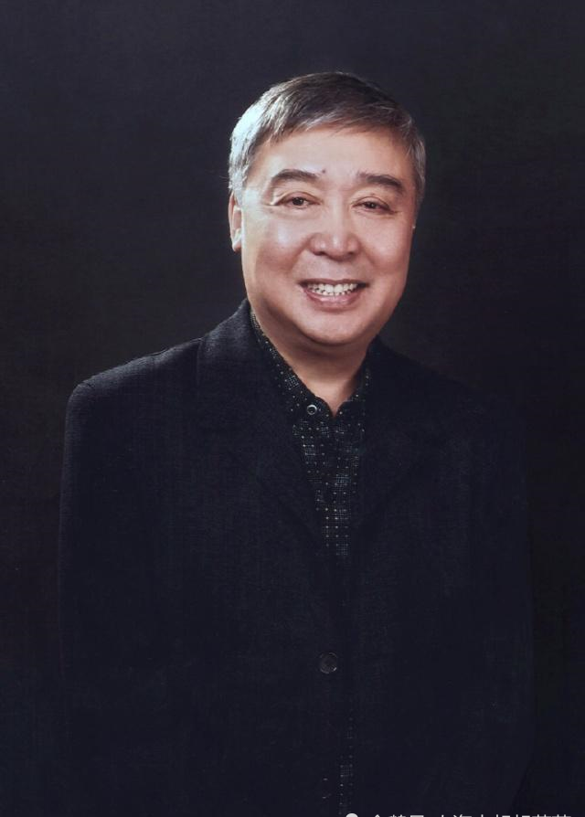

# 师胜杰

- 姓名：师胜杰
- 性别：男
- 国籍：中国
- 出生日期：1953年4月3日
- 去世日期：2018年9月28日
- 去世原因：肝癌

# 生平简介

师胜杰，天津人，出生于相声世家，父亲师世元、母亲高秀琴都是相声演员。7岁登台与父亲合说《捉放曹》，8岁拜朱相臣为师。1969年到兵团下乡，1977年调入黑龙江省曲艺团成为专业相声演员。1984年拜侯宝林为师，成为侯宝林关门弟子。曾四次登上央视春晚，表演《招聘》《同桌的你》等作品。2018年9月28日因病在哈尔滨逝世，享年66岁。

# 主要贡献

师胜杰是中国相声界的重要人物，被誉为"侯派相声的最佳传承人"。他继承了侯宝林的表演风格，形成了自己文雅清新、质朴自然的艺术风格。他创作表演了《我要补课》《肝胆相照》《小鞋匠的奇遇》等经典作品。他曾获全国十大笑星、中国曲艺牡丹奖终身成就奖等荣誉，享受国务院特殊津贴。他培养了李菁、邹德江等一批优秀相声演员。

# 参考资料

- 百度百科链接：https://m.baike.com/wiki/%E5%B8%88%E8%83%9C%E6%9D%B0/1487704
