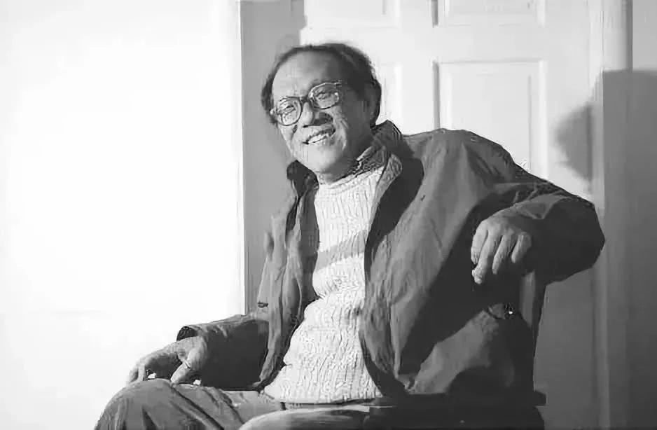

# 史铁生

- 姓名：史铁生
- 性别：男
- 国籍：中国
- 出生日期：1951年1月4日
- 去世日期：2010年12月31日
- 去世原因：突发脑溢血

# 生平简介

史铁生，北京人，中国当代著名作家。21岁因病双腿瘫痪，此后以轮椅为伴坚持写作。2010年12月31日在北京逝世，享年59岁。

# 主要贡献

代表作《我与地坛》《务虚笔记》《命若琴弦》等，以深邃的哲思书写生命与苦难，影响一代读者。

# 参考资料

- 百度百科链接：https://baike.baidu.com/item/%E5%8F%B2%E9%93%81%E7%94%9F
