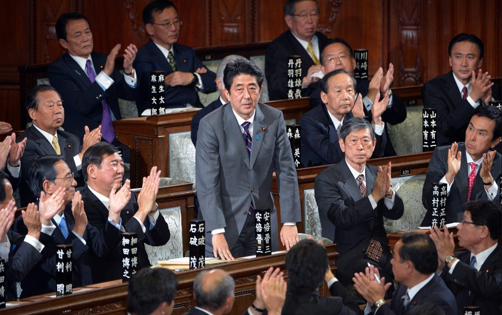

# 安倍晋三

- 姓名：安倍晋三
- 性别：男
- 国籍：日本
- 出生日期：1954年9月21日
- 去世日期：2022年7月8日
- 去世原因：遭枪击遇刺身亡

# 生平简介

安倍晋三，日本政治家，出生于山口县，毕业于成蹊大学。2006年至2007年、2012年至2020年两度出任日本首相，是日本历史上在任时间最长的首相。2022年7月8日在奈良市发表街头演讲时遭枪击，当日抢救无效逝世，享年67岁。

# 主要贡献

推行"安倍经济学"推动日本经济复苏，任内推动修宪讨论和日本对外关系调整。

# 参考资料

- 百度百科链接：https://baike.baidu.com/item/%E5%AE%89%E5%80%8D%E6%99%8B%E4%B8%89
