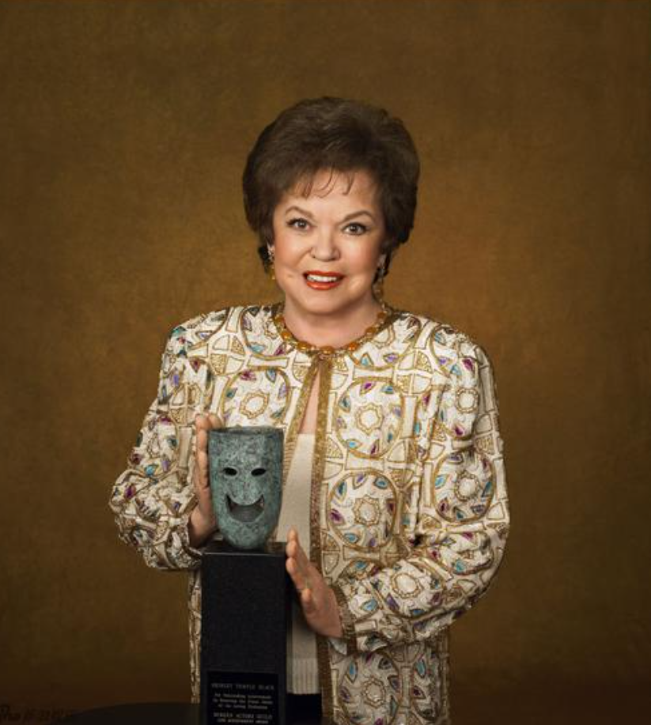

# 秀兰·邓波儿

- 姓名：秀兰·邓波儿
- 性别：女
- 国籍：美国
- 出生日期：1928年4月23日
- 去世日期：2014年2月10日
- 去世原因：自然衰老

# 生平简介

秀兰·邓波儿（Shirley Temple），出生于美国加利福尼亚州圣莫尼卡，美国著名童星、外交官。3岁开始学习舞蹈，5岁出演电影《起立欢呼》，一举成名。她主演了《小上校》《海蒂》《卷毛头》等多部经典影片，成为20世纪30年代最受欢迎的童星。1945年退出影坛，1969年开始从事外交工作，曾任美国驻加纳大使、驻捷克斯洛伐克大使等职。2014年2月10日在美国加州逝世，享年85岁。

# 主要贡献

秀兰·邓波儿是电影史上最著名的童星，她的表演天真可爱，给大萧条时期的美国人带来了希望和欢乐。她获得过奥斯卡终身成就奖，是美国电影学会评选的"百年来最伟大的女演员"之一。她后来转型成为外交官，为美国外交事业做出了贡献。

# 参考资料

- 百度百科链接：https://m.baike.com/wiki/%E4%BF%AE%E5%85%B0%C2%B7%E9%82%93%E6%B3%A2%E5%84%BF/11698976