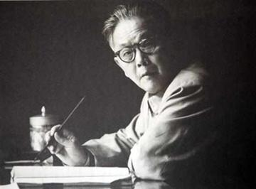

# 舒同

- 姓名：舒同
- 性别：男
- 国籍：中国
- 出生日期：1905年11月25日
- 去世日期：1998年5月27日
- 去世原因：病逝

# 生平简介

舒同，字文藻，又名宜禄，江西抚州市东乡区人，书法大师。1926年加入中国共产党。五四运动影响下，1920年在家乡成立"金兰同学社"传播新思想。1921年考入江西省立第三师范学校，发起组织"马克思主义研究会"。参加长征，任红一军团政治部宣传部部长。抗日战争时期任八路军总部秘书长、中央军委总政治部秘书长。解放战争时期任华东军区政治部主任。新中国成立后，曾任中共山东省委第一书记、陕西省委书记、中国人民解放军军事科学院副院长。他是中国书法家协会的创办人和第一任主席，中共中央顾问委员会委员。1998年5月27日逝世，享年93岁。

# 主要贡献

舒同是当代中国书法大师，"舒体"创始人。他的书法宽博端庄、圆劲婉通，自成一体，被称为"舒体"，被广泛用于报刊题名和牌匾书写。他创办了中国书法家协会并担任第一任主席，为中国书法艺术的传承和发展做出了开创性贡献。此外，他作为老一辈革命家，为中国革命和建设事业贡献了一生。他将革命生涯与书法艺术完美结合，被毛泽东誉为"红军书法家、党内一枝笔"。

# 参考资料

- 百度百科链接：https://m.baike.com/wiki/%E8%88%92%E5%90%8C
