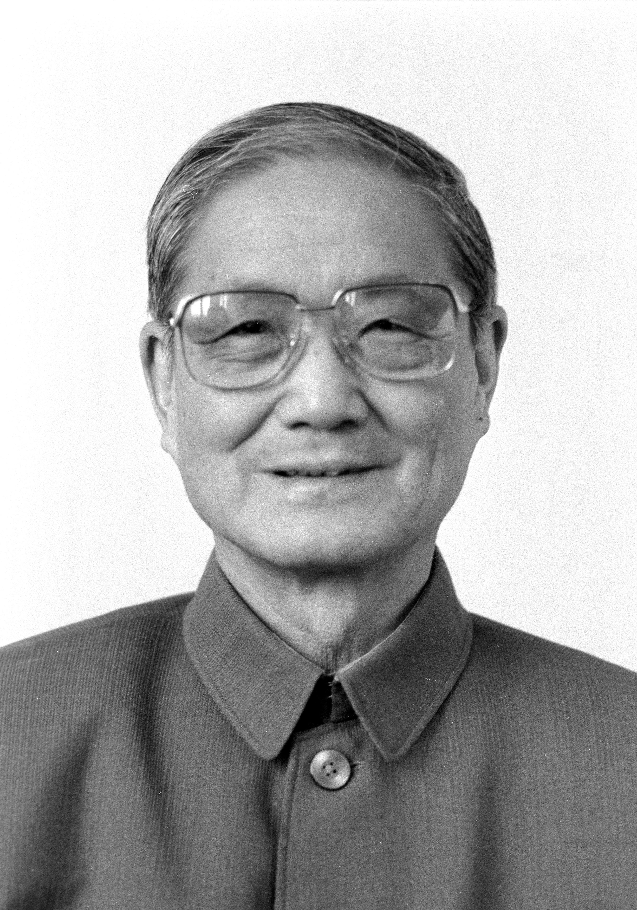

# 宋平

- 姓名：宋平
- 性别：男
- 国籍：中国
- 出生日期：1917年4月
- 去世日期：2026年3月4日
- 去世原因：因病医治无效

# 生平简介

宋平，山东莒县人，中国共产党的优秀党员，久经考验的忠诚的共产主义战士，党和国家的卓越领导人。1936年参加革命工作，1937年加入中国共产党。清华大学毕业后长期在党和国家重要岗位工作，曾任国家计划委员会主任、国务委员、中共中央组织部部长、中央政治局常委。2026年3月4日在北京逝世，享年109岁。

# 主要贡献

长期从事国家经济计划和干部人事工作，为国民经济恢复发展、党的组织建设和干部队伍建设作出重要贡献；晚年热心公益，资助贫困学子。

# 参考资料

- 百度百科链接：https://baike.baidu.com/item/%E5%AE%8B%E5%B9%B3
