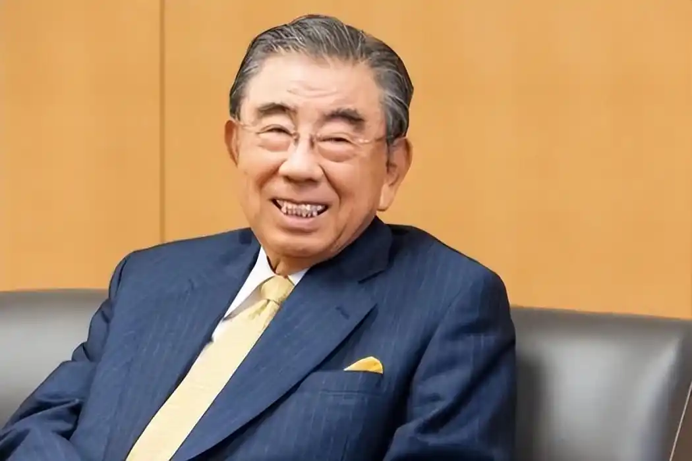

# 铃木敏文

- 姓名：铃木敏文
- 性别：男
- 国籍：日本
- 出生日期：1932年12月1日
- 去世日期：2026年5月18日
- 去世原因：心力衰竭

# 生平简介

出生于日本长野县，毕业于中央大学经济学部。早年曾在出版科学研究所从事调查工作，后进入东京出版贩卖（现东贩）工作。1963年正式加入伊藤洋华堂（现永旺）。1973年牵头成立日本第一家便利店连锁公司，1974年5月在日本东京都江东区开出第一家7-Eleven门店。1992年出任洋华堂社长，2005年担任柒和伊控股集团董事长兼CEO。2016年辞去董事长兼CEO职务。

# 主要贡献

将7-Eleven便利店模式引入日本并发扬光大，开创了日本便利店文化。在他的领导下，7-Eleven在全球拥有数万家门店，成为全球最大的连锁便利店品牌。

# 参考资料

- 百度百科链接：https://www.baike.com/wiki/%E9%93%83%E6%9C%A8%E6%95%8F%E6%96%87
