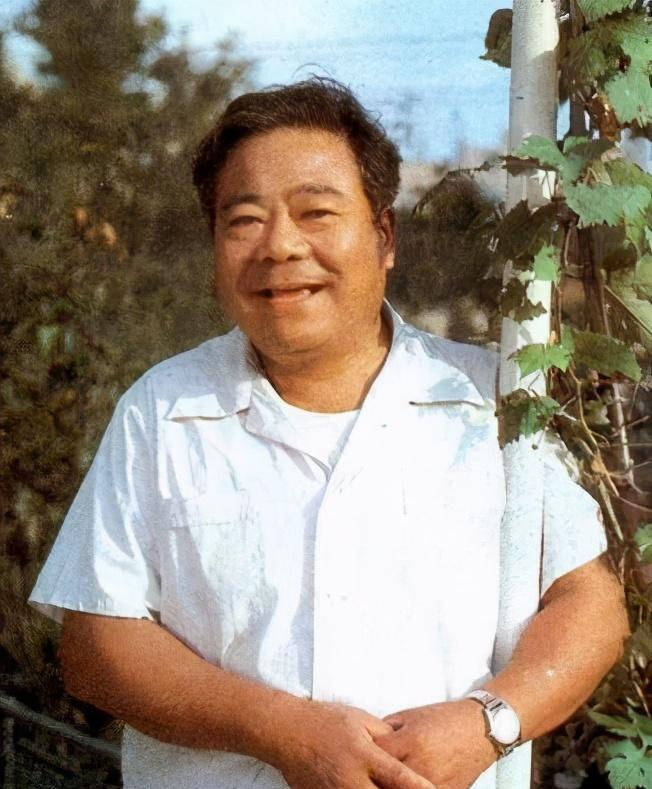

# 铁牛

- 姓名：铁牛
- 性别：男
- 国籍：中国
- 出生日期：1922年
- 去世日期：2015年3月5日
- 去世原因：自然衰老

# 生平简介

铁牛，原名杨锡业，出生于山东掖县，中国著名电影演员。1946年参加新四军，进入华东军区文工团。1949年开始电影生涯，参演了《渡江侦察记》《南征北战》《红色娘子军》等经典影片。他在《西游记》中饰演牛魔王，深受观众喜爱。2015年3月5日因病逝世，享年93岁。

# 主要贡献

铁牛是中国电影界的老艺术家，参演了数十部经典影片，塑造了许多深入人心的角色。他的表演朴实自然，充满生活气息。他为中国电影事业的发展做出了重要贡献，是观众喜爱的银幕形象。

# 参考资料

- 百度百科链接：https://m.baike.com/wiki/%E9%93%81%E7%89%9B/661104