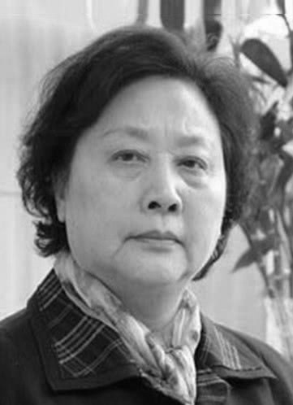

# 童正维

- 姓名：童正维
- 性别：女
- 国籍：中国
- 出生日期：1937年
- 去世日期：2025年4月14日
- 去世原因：心脏衰竭

# 生平简介

毕业于上海戏剧学院表演系，中国内地女演员，上海青年话剧团演员。1983年出演电视剧《裤裆巷风流记》出道。1992年在都市电视剧《编辑部的故事》中饰演牛大姐一角，深入人心。1996年参加中央电视台春节联欢晚会，与魏启明、何冰等出演小品《一个钱包》。参演作品还包括电视剧《摩登家庭》《满堂爹娘》《祈望》等。

# 主要贡献

在《编辑部的故事》中成功塑造了牛大姐这一经典角色，成为中国电视剧史上的标志性形象。毕生致力于话剧与影视表演事业，为中国影视艺术做出了贡献。

# 参考资料

- 百度百科链接：https://www.baike.com/wiki/%E7%AB%A5%E6%AD%A3%E7%BB%B4
