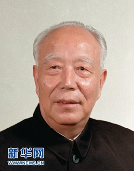

# 万里

- 姓名：万里
- 性别：男
- 国籍：中国
- 出生日期：1916年12月
- 去世日期：2015年7月15日
- 去世原因：因病医治无效

# 生平简介

万里，山东东平人，中国共产党的优秀党员，久经考验的忠诚的共产主义战士。1936年参加革命工作并加入中国共产党。曾主持安徽农村改革，支持"包产到户"。曾任国务院副总理、中央书记处书记。1988年至1993年任全国人大常委会委员长。2015年7月15日在北京逝世，享年99岁。

# 主要贡献

改革开放初期主持安徽农村改革，率先支持家庭联产承包责任制；任全国人大常委会委员长期间推动人大制度建设和立法工作。

# 参考资料

- 百度百科链接：https://baike.baidu.com/item/%E4%B8%87%E9%87%8C
