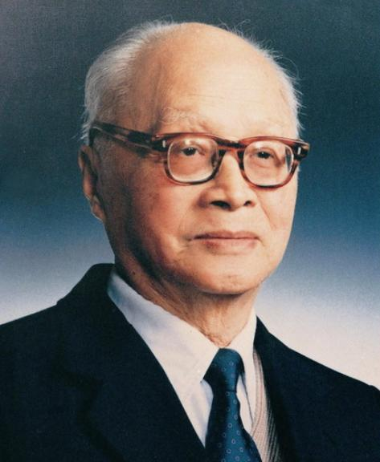

# 王淦昌

- 姓名：王淦昌
- 性别：男
- 国籍：中国
- 出生日期：1907年5月28日
- 去世日期：1998年12月10日
- 去世原因：因病医治无效

# 生平简介

王淦昌，江苏常熟人，中国核物理学家，"两弹一星"元勋。1929年毕业于清华大学，1934年获德国柏林大学博士学位。曾任中国科学院院士。1998年12月10日在北京逝世，享年91岁。

# 主要贡献

提出验证中微子存在的实验方案；参与领导中国原子弹、氢弹研制和地下核试验，为核武器事业作出重大贡献。

# 参考资料

- 百度百科链接：https://baike.baidu.com/item/%E7%8E%8B%E6%B7%A6%E6%98%8C
