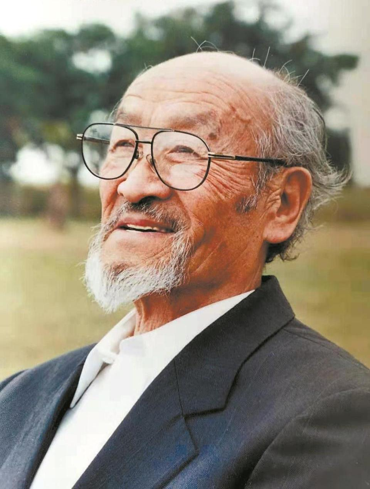

# 王洛宾

- 姓名：王洛宾
- 性别：男
- 国籍：中国
- 出生日期：1913年12月28日
- 去世日期：1996年3月14日
- 去世原因：胆囊癌

# 生平简介

王洛宾，出生于北京，中国著名作曲家。1934年考入北京师范大学音乐系，1938年赴西北，开始收集整理新疆民歌。他改编创作了《在那遥远的地方》《半个月亮爬上来》《达坂城的姑娘》等经典歌曲。1996年3月14日在乌鲁木齐逝世，享年83岁。

# 主要贡献

王洛宾是中国西部民歌的重要传播者，被誉为"西部歌王"。他改编的新疆民歌传遍全国，成为中国音乐文化的重要组成部分。他获得过联合国教科文组织颁发的"东西方文化交流特别贡献奖"。

# 参考资料

- 百度百科链接：https://m.baike.com/wiki/%E7%8E%8B%E6%B4%9B%E5%AE%BE/355599