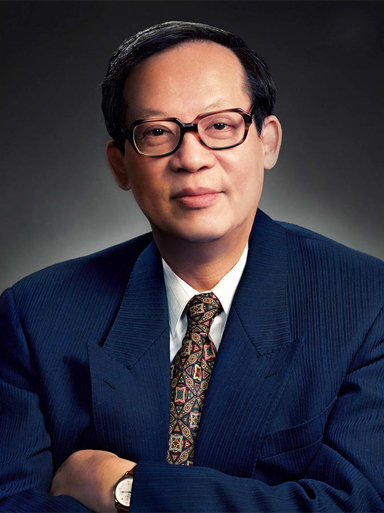

# 王选

- 姓名：王选
- 性别：男
- 国籍：中国
- 出生日期：1937年2月5日
- 去世日期：2006年2月13日
- 去世原因：因病医治无效

# 生平简介

王选，江苏无锡人，中国计算机科学家，汉字激光照排系统创始人。1958年毕业于北京大学数学力学系。曾任北京大学教授、中国科学院院士、中国工程院院士。2006年2月13日在北京逝世，享年70岁。

# 主要贡献

主持研制汉字激光照排系统，使中国印刷业告别铅与火、走向光与电；获2001年国家最高科学技术奖。

# 参考资料

- 百度百科链接：https://baike.baidu.com/item/%E7%8E%8B%E9%80%89
