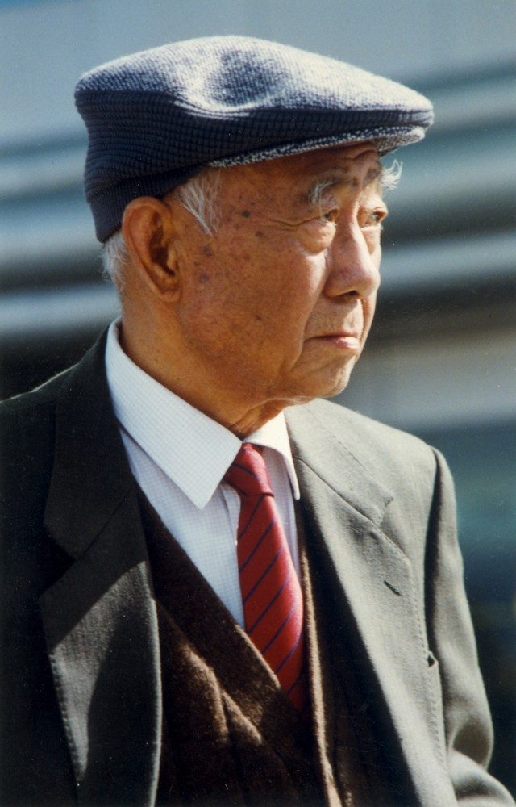

# 汪曾祺

- 姓名：汪曾祺
- 性别：男
- 国籍：中国
- 出生日期：1920年3月5日
- 去世日期：1997年5月16日
- 去世原因：消化道出血

# 生平简介

汪曾祺，江苏高邮人，中国著名作家、散文家、戏剧家，沈从文的入室弟子。早年就读于西南联大，后长期从事文学创作和编辑工作。1958年被错划为右派，下放劳动多年。改革开放后复出文坛，创作了大量独具风格的短篇小说和散文。其文风平淡质朴、清雅隽永，被誉为"中国最后一个纯粹的文人"。1997年5月16日在北京逝世。

# 主要贡献

短篇小说代表作《受戒》《大淖记事》等，开创中国当代文学独特的抒情叙事风格；散文创作以写饮食、草木、乡土见长，被誉为"文章圣手"；参与现代京剧《沙家浜》编剧工作。

# 参考资料

- 百度百科链接：
