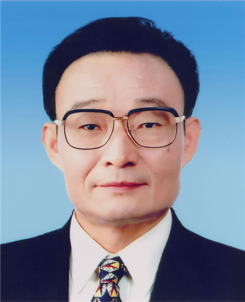

# 吴邦国

- 姓名：吴邦国
- 性别：男
- 国籍：中国
- 出生日期：1941年7月
- 去世日期：2024年10月9日
- 去世原因：因病医治无效

# 生平简介

吴邦国，安徽肥东人，中国共产党的优秀党员，党和国家的卓越领导人。1964年毕业于清华大学无线电电子学系，1965年加入中国共产党。曾长期在上海工作，1991年任上海市委书记。1995年任国务院副总理，2002年当选中央政治局常委，2003年至2013年任全国人大常委会委员长。2024年10月9日在北京逝世，享年84岁。

# 主要贡献

任全国人大常委会委员长期间推动中国特色社会主义法律体系形成，主持人大立法和监督工作，为依法治国作出重要贡献。

# 参考资料

- 百度百科链接：https://baike.baidu.com/item/%E5%90%B4%E9%82%A6%E5%9B%BD
