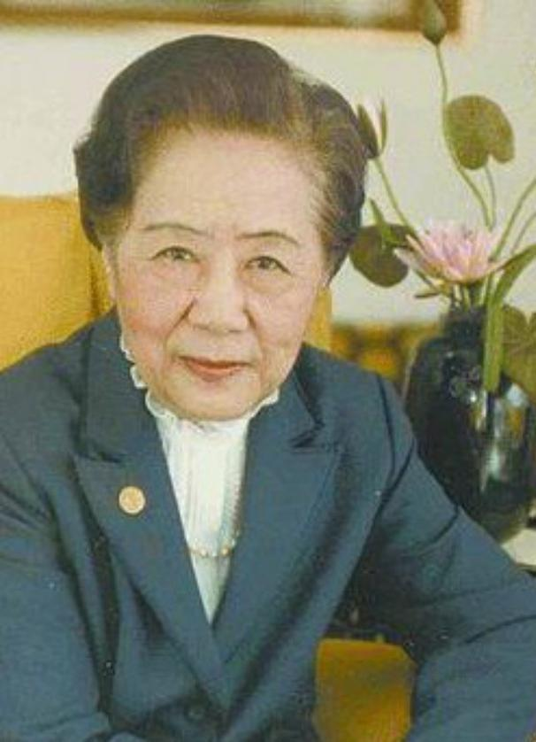

# 吴健雄（Chien-Shiung Wu）

- 姓名：吴健雄
- 性别：女
- 国籍：美国（美籍华人）
- 出生日期：1912年5月31日
- 去世日期：1997年2月16日
- 去世原因：中风

# 生平简介

吴健雄，江苏太仓人，美籍华裔物理学家，实验物理学大师。1936年赴美留学，1940年获加州大学伯克利分校物理学博士。长期在哥伦比亚大学从事核物理研究，以精准的实验技术闻名于世。1956年通过"吴氏实验"首次验证了弱相互作用中的宇称不守恒，为杨振宁、李政道获得诺贝尔物理学奖提供了关键实验证据。曾任美国物理学会会长（首位女性会长）。1997年2月16日在纽约逝世。

# 主要贡献

设计并实施"吴氏实验"，首次在实验中证明宇称不守恒；在β衰变领域的研究具有开创性贡献，被誉为"核物理女王"和"中国居里夫人"；获美国国家科学奖章、沃尔夫物理学奖等多项荣誉。

# 参考资料

- 百度百科链接：
