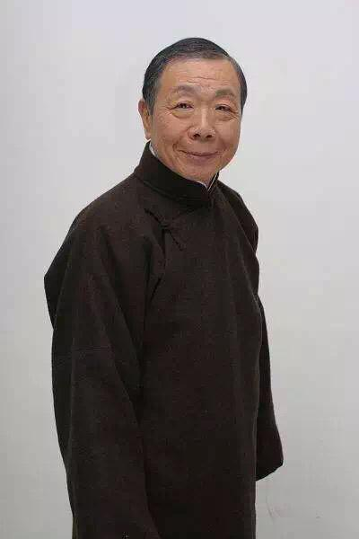

# 午马

- 姓名：午马
- 性别：男
- 国籍：中国（香港）
- 出生日期：1942年5月28日
- 去世日期：2014年2月4日
- 去世原因：肺癌

# 生平简介

午马，本名冯宏源，香港著名演员、导演。早年任邵氏武师，参演影视作品数百部。2014年2月4日在香港逝世，享年71岁。

# 主要贡献

凭《倩女幽魂》"燕赤霞"一角深入人心，参演《鬼打鬼》《笑傲江湖》等，是香港电影黄金时代的标志性配角。

# 参考资料

- 百度百科链接：https://baike.baidu.com/item/%E5%8D%88%E9%A9%AC
