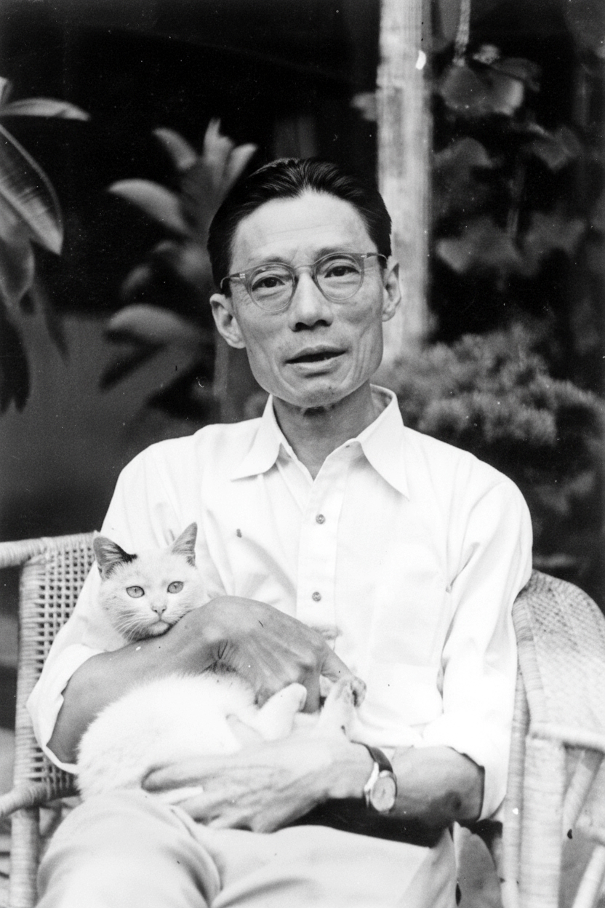

# 夏衍

- 姓名：夏衍
- 性别：男
- 国籍：中国
- 出生日期：1900年10月30日
- 去世日期：1995年2月6日
- 去世原因：因病逝世

# 生平简介

夏衍，原名沈乃熙，浙江杭州人，中国著名的文学家、剧作家、电影编剧、社会活动家。早年留学日本，1927年回国后加入中国共产党，参与筹建左翼作家联盟。新中国成立后曾任文化部副部长、中国文联副主席等职。其创作涉及话剧、电影、报告文学、散文等多个领域。1995年2月6日在北京逝世。

# 主要贡献

中国左翼电影运动的开拓者，代表作品包括话剧《上海屋檐下》《法西斯细菌》、报告文学《包身工》；改编鲁迅《祝福》、茅盾《林家铺子》等经典电影剧本；获国务院授予"国家有杰出贡献的电影艺术家"称号。

# 参考资料

- 百度百科链接：
