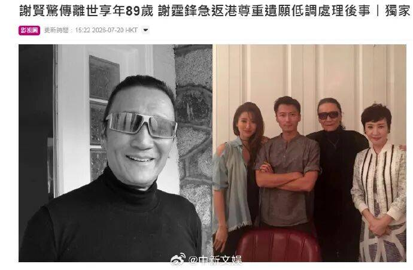

# 谢贤

- 姓名：谢贤
- 性别：男
- 国籍：中国（香港）
- 出生日期：1936年8月9日
- 去世日期：2026年7月16日
- 去世原因：肺炎

# 生平简介

谢贤，原名谢家钰，别名"四哥"，1936年8月9日出生于中国香港，祖籍广东番禺，华语影视演员、导演、编剧。因在家中八个兄弟姐妹排行第四，又在TVB经典剧集《千王之王》中饰演"罗四海"，而被称呼为"四哥"。16岁毕业于香港九龙丽泽中学，1953年考入岭光公司演员训练班进入演艺圈，拍摄首部电影《楼下闩水喉》。1955年加盟光艺影片公司，主演《胭脂虎》《九九九命案》《难兄难弟》等影片，迅速走红，成为五六十年代香港影坛的首席小生，演艺生涯长达七十余年。有过两段婚姻，先后与甄珍、狄波拉，育有儿子谢霆锋、女儿谢婷婷。2026年7月16日因肺炎去世，享年89岁。

# 主要贡献

谢贤是香港影坛殿堂级艺人，纵横影坛七十余年，主演影视作品逾百部，代表作包括《千王之王》《难兄难弟》《萧十一郎》等。2019年获颁第38届香港电影金像奖终身成就奖；2022年凭电影《杀出个黄昏》夺得第40届香港电影金像奖最佳男主角，以85岁高龄成为香港电影金像奖史上最年长的影帝，书写了华语影坛的传奇。

# 参考资料

- 百度百科链接：https://baike.baidu.com/item/%E8%B0%A2%E8%B4%A4
