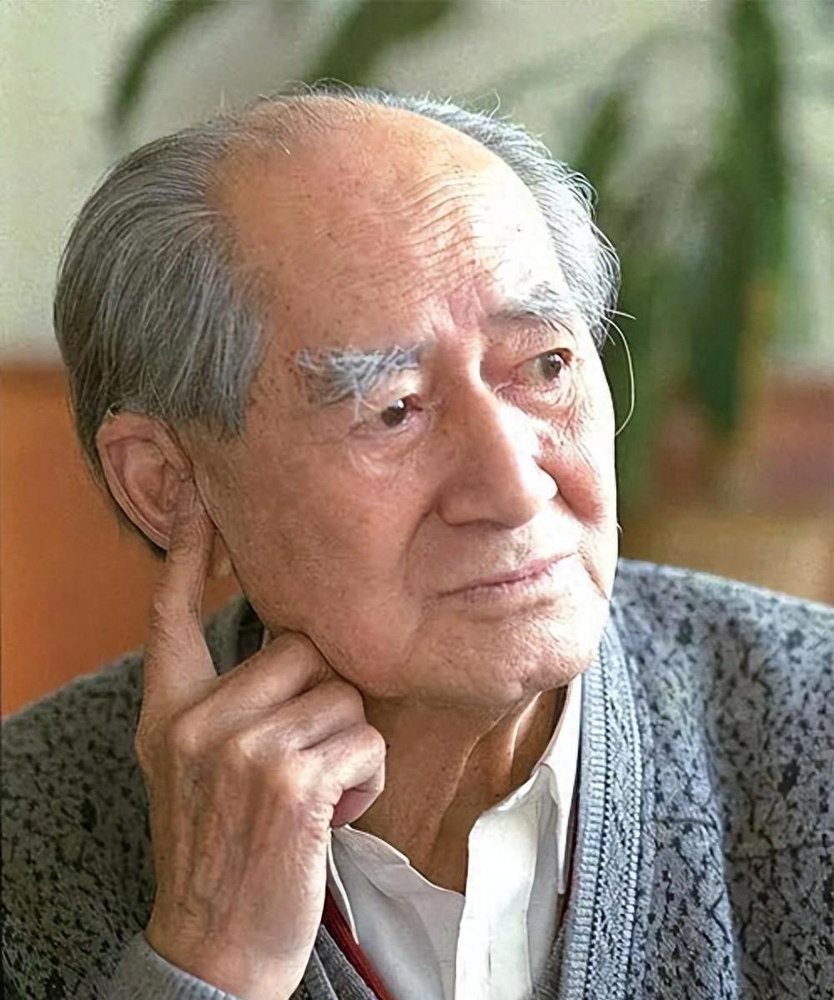

# 徐迟

- 姓名：徐迟
- 性别：男
- 国籍：中国
- 出生日期：1914年10月15日
- 去世日期：1996年12月12日
- 去世原因：跳楼自杀

# 生平简介

徐迟，原名徐商寿，出生于浙江吴兴，中国著名诗人、散文家。1931年开始发表作品，1949年后任《人民文学》副主编。他的报告文学《哥德巴赫猜想》影响深远，使陈景润成为家喻户晓的人物。1996年12月12日在武汉逝世，享年82岁。

# 主要贡献

徐迟是中国报告文学的重要作家，他的《哥德巴赫猜想》开创了科学报告文学的先河，将科学家的事迹生动地展现给读者。他的作品激励了一代青年投身科学事业。

# 参考资料

- 百度百科链接：https://m.baike.com/wiki/%E5%BE%90%E8%BF%9F/355603