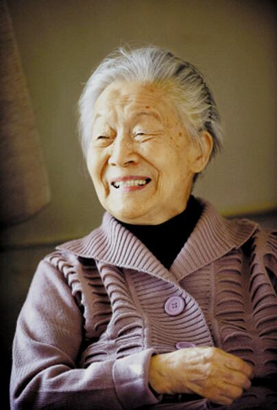

# 杨绛

- 姓名：杨绛
- 性别：女
- 国籍：中国
- 出生日期：1911年7月17日
- 去世日期：2016年5月25日
- 去世原因：自然衰老

# 生平简介

杨绛，原名杨季康，祖籍江苏无锡，出生于北京，中国著名作家、文学翻译家、外国文学研究家。1932年考入清华大学，1935年与钱钟书结婚后赴英国牛津大学深造，后转赴法国巴黎大学学习。1938年回国，先后在上海震旦女子文理学院、清华大学任教。1953年任北京大学文学研究所研究员。她翻译的《堂吉诃德》被公认为最佳译本之一。晚年著有《我们仨》《走到人生边上》等作品。2016年5月25日在北京逝世，享年105岁。

# 主要贡献

杨绛是中国文坛的"才女"，翻译的《堂吉诃德》获西班牙国王颁发的"智慧国王阿方索十世十字勋章"。她的散文风格平实简洁、温婉细腻，《我们仨》以真挚情感讲述家庭故事，感动无数读者。她与钱钟书被誉为"文坛伉俪"，共同创作了大量文学作品。她淡泊名利，潜心治学，被誉为"最贤的妻，最才的女"。她的作品被翻译成多种语言，在国内外享有盛誉。

# 参考资料

- 百度百科链接：https://m.baike.com/wiki/%E6%9D%A8%E6%A5%9A/357577