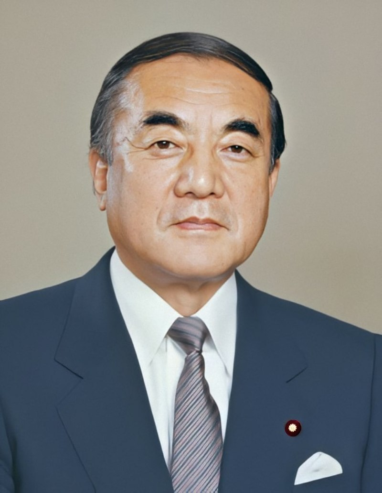

# 中曾根康弘

- 姓名：中曾根康弘
- 性别：男
- 国籍：日本
- 出生日期：1918年5月27日
- 去世日期：2019年11月29日
- 去世原因：自然衰老

# 生平简介

中曾根康弘，日本政治家，生于群马县。1982年至1987年任日本首相。2019年11月29日在东京逝世，享年101岁。

# 主要贡献

推行行政改革和国企民营化，推动日美同盟强化，是战后日本政治的重要人物。

# 参考资料

- 百度百科链接：https://baike.baidu.com/item/%E4%B8%AD%E6%9B%BE%E6%A0%B9%E5%BA%B7%E5%BC%98
