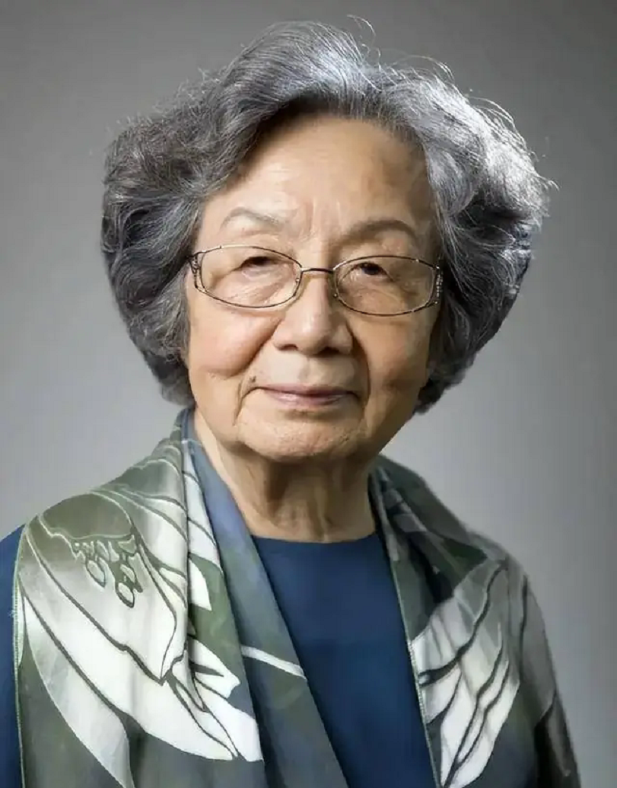

# 叶嘉莹

- 姓名：叶嘉莹
- 性别：女
- 国籍：中国
- 出生日期：1924年
- 去世日期：2024年11月24日
- 去世原因：自然衰老

# 生平简介

叶嘉莹是中国古典文学研究专家、教育家、诗人，南开大学讲席教授。毕业于北京辅仁大学国文系，后赴哈佛大学任教。2014年回国定居南开大学。她致力于中华古典诗词的传播和研究，培养了大批古典文学人才。2018年宣布将全部财产捐赠给南开大学设立"迦陵基金"。2024年去世，享年100岁。

# 主要贡献

对中国古典文学进行深入研究，著作《迦陵论词》《迦陵论诗》等；培养大批古典文学研究人才；向南开大学捐赠3568万元设立"迦陵基金"推动诗词教育；被誉为"中国古典文学研究泰斗"。

# 参考资料

- 百度百科链接：https://m.baike.com/wiki/%E5%8F%B6%E5%98%89%E8%8E%B9/340655
