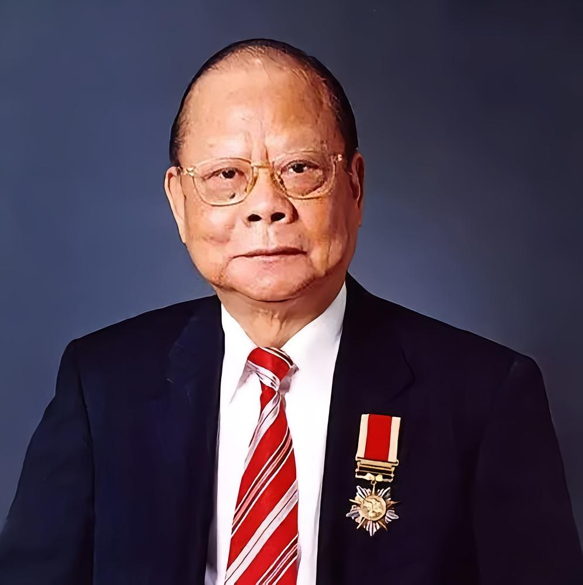

# 曾宪梓

- 姓名：曾宪梓
- 性别：男
- 国籍：中国
- 出生日期：1934年2月2日
- 去世日期：2019年9月20日
- 去世原因：因病去世

# 生平简介

出生于广东省梅州市，客家人。1961年毕业于中山大学生物系。1963年辞掉工作举家去泰国，1968年回到香港使用"金狮"品牌在领带行业创业。1971年将"金狮"改为"金利来"，1974年金利来成为高端品牌港货。1986年开始到内地投资设厂，1992年金利来集团有限公司在香港成立。曾任全国工商联副主席，第八届、九届、十届全国人大常委。20世纪70年代末开始捐资支持国家教育事业，历年捐资逾1400项次，累计金额超过12亿港元。

# 主要贡献

创立金利来品牌，被誉为"领带大王"。热心公益事业，设立曾宪梓教育基金、曾宪梓载人航天基金和曾宪梓体育基金。1993年南京紫金山天文台以国际编号3388号小行星誉名为"曾宪梓星"。1997年获香港特别行政区政府大紫荆勋章，2018年获"改革先锋"称号。

# 参考资料

- 百度百科链接：https://www.baike.com/wiki/%E6%9B%BE%E5%AE%AA%E6%A2%93
