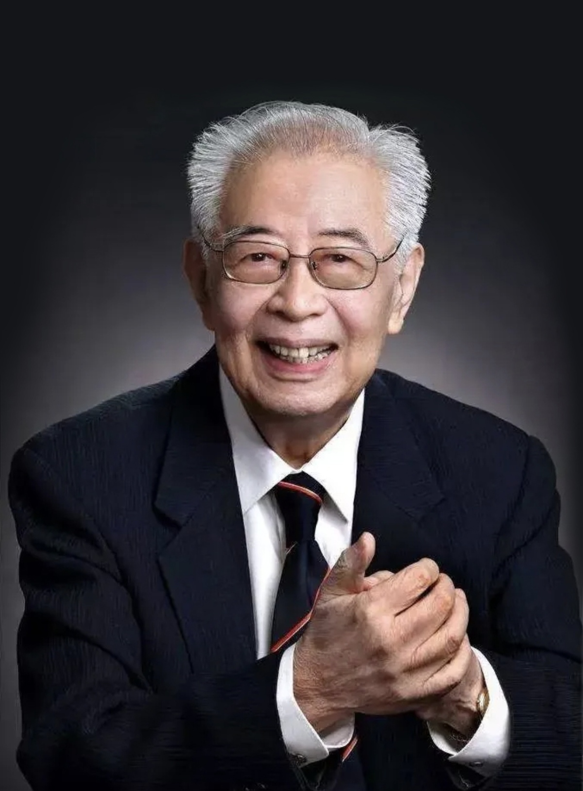

# 张存浩

- 姓名：张存浩
- 性别：男
- 国籍：中国
- 出生日期：1928年2月
- 去世日期：2024年8月27日
- 去世原因：因病医治无效

# 生平简介

张存浩，天津人，中国物理化学家、激光化学家，中国科学院院士。1950年毕业于美国密歇根大学。曾任中国科学院大连化学物理研究所所长、国家自然科学基金委员会主任。2024年8月27日在北京逝世，享年96岁。

# 主要贡献

主持研制中国第一台化学激光器，在分子反应动力学等领域作出开创性贡献；获2013年国家最高科学技术奖。

# 参考资料

- 百度百科链接：https://baike.baidu.com/item/%E5%BC%A0%E5%AD%98%E6%B5%A9
