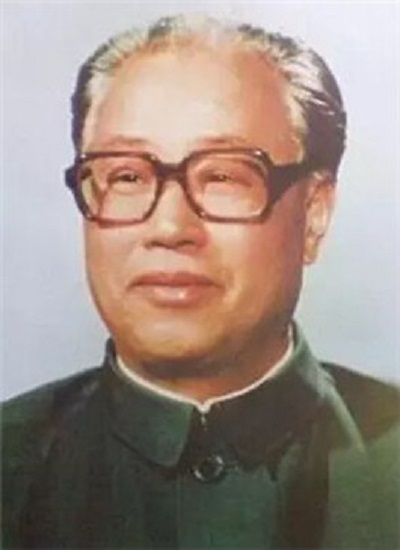

# 赵紫阳

- 姓名：赵紫阳
- 性别：男
- 国籍：中国
- 出生日期：1919年10月17日
- 去世日期：2005年1月17日
- 去世原因：因病医治无效

# 生平简介

赵紫阳，河南滑县人，1980年至1987年任国务院总理，1987年至1989年任中共中央总书记。2005年1月17日在北京逝世，享年85岁。

# 主要贡献

主持农村改革，推动家庭联产承包责任制；任总理期间推进经济体制改革。

# 参考资料

- 百度百科链接：https://baike.baidu.com/item/%E8%B5%B5%E7%B4%AB%E9%98%B3
