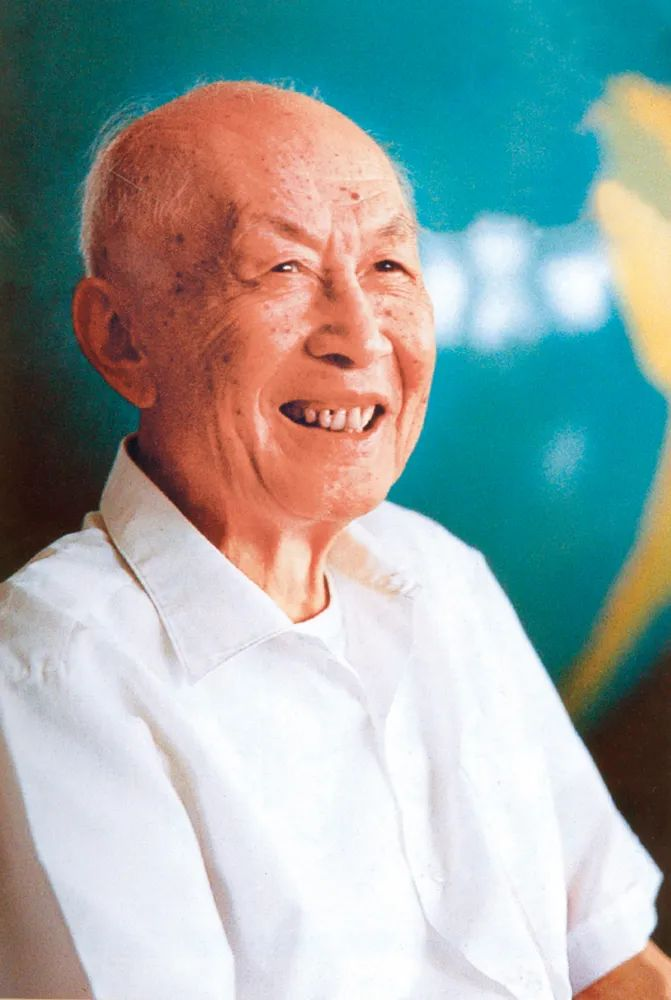

# 朱光亚

- 姓名：朱光亚
- 性别：男
- 国籍：中国
- 出生日期：1924年12月25日
- 去世日期：2011年2月26日
- 去世原因：因病医治无效

# 生平简介

朱光亚，湖北武汉人，中国核物理学家，"两弹一星"元勋。1945年毕业于西南联合大学，后赴美国密歇根大学获博士学位。曾任中国工程院首任院长、中国科协主席。2011年2月26日在北京逝世，享年87岁。

# 主要贡献

参与组织领导中国原子弹、氢弹和核武器研制，获"两弹一星"功勋奖章。

# 参考资料

- 百度百科链接：https://baike.baidu.com/item/%E6%9C%B1%E5%85%89%E4%BA%9A
