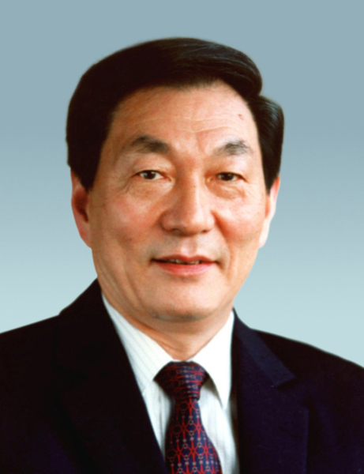

# 朱镕基

- 姓名：朱镕基
- 性别：男
- 国籍：中国
- 出生日期：1928年10月
- 去世日期：2026年8月12日
- 去世原因：因病医治无效

# 生平简介

朱镕基，1928年10月生于湖南长沙，中国共产党的优秀党员，久经考验的忠诚的共产主义战士，杰出的无产阶级革命家、政治家，党和国家的卓越领导人。1948年12月参加革命工作，1949年10月加入中国共产党。1947年至1951年在清华大学电机系电机制造专业学习。长期在国家计划委员会、国家经济委员会等经济部门工作。1987年至1991年历任上海市委副书记、市长、市委书记，推动浦东开发开放进入实质性启动阶段。1991年任国务院副总理，1992年当选中央政治局常委，1993年兼任中国人民银行行长。1998年3月至2003年3月任国务院总理。2026年8月12日11时06分在北京逝世，享年98岁。

# 主要贡献

朱镕基在担任国务院副总理和国务院总理期间，主持了财税体制改革，实施分税制财政体制；推进金融体制改革，规范中央银行职能，深化商业银行、外汇制度、证券期货市场等改革；把国有企业改革作为经济体制改革的中心环节，加快现代企业制度建设；推进住房制度改革、粮食流通体制改革、社会保障体制、医药卫生体制和投融资体制等一系列重大改革，推动建立社会主义市场经济体制的基本框架；主持完成我国加入世界贸易组织的艰苦谈判，促进对外开放向广度和深度拓展。面对亚洲金融危机冲击和国内特大洪涝灾害，实行积极的财政政策和稳健的货币政策，保持了经济稳定、快速增长。

# 参考资料

- 百度百科链接：https://baike.baidu.com/item/%E6%9C%B1%E9%95%89%E5%9F%BA
