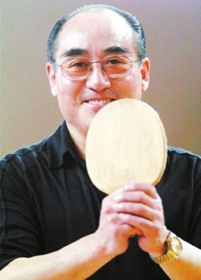

# 庄则栋

- 姓名：庄则栋
- 性别：男
- 国籍：中国
- 出生日期：1940年8月25日
- 去世日期：2013年2月10日
- 去世原因：因病医治无效

# 生平简介

庄则栋，江苏扬州人，中国乒乓球运动员。2013年2月10日在北京逝世，享年73岁。

# 主要贡献

三次夺得世乒赛男子单打冠军，是20世纪60年代中国乒乓球队核心；1971年"乒乓外交"中与美国运动员的友好互动，为中美关系破冰作出独特贡献。

# 参考资料

- 百度百科链接：https://baike.baidu.com/item/%E5%BA%84%E5%88%99%E6%A0%8B
