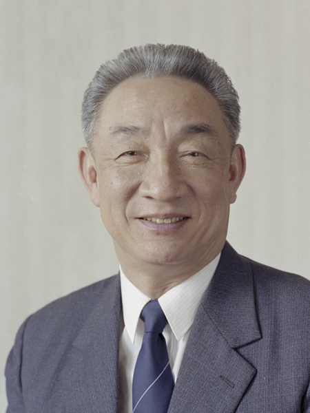

# 邹家华

- 姓名：邹家华
- 性别：男
- 国籍：中国
- 出生日期：1926年10月
- 去世日期：2025年2月18日
- 去世原因：因病医治无效

# 生平简介

邹家华，江西高安人（生于上海），中国共产党的优秀党员，久经考验的忠诚的共产主义战士。1945年加入中国共产党，早年赴苏联留学。曾任机械工业部部长、国务委员兼国家计划委员会主任，1991年至1998年任国务院副总理。2025年2月18日在北京逝世，享年99岁。

# 主要贡献

长期主持机械工业和国民经济计划工作，为国防工业和国民经济发展作出重要贡献。

# 参考资料

- 百度百科链接：https://baike.baidu.com/item/%E9%82%B9%E5%AE%B6%E5%8D%8E
